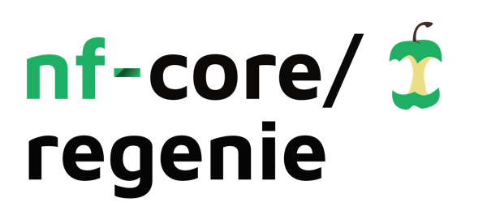

<h1>
  <picture>
    <source media="(prefers-color-scheme: dark)" srcset="docs/images/nf-core-regenie_logo_dark.png">
    
  </picture>
</h1>

[](https://github.com/CreRecombinase/nf-regenie/actions/workflows/nf-test.yml)
[](https://github.com/CreRecombinase/nf-regenie/actions/workflows/linting.yml)
[](https://cloud.seqera.io/launch?pipeline=https://github.com/CreRecombinase/nf-regenie)

## Overview

CreRecombinase/nf-regenie is a Nextflow pipeline that runs genome-wide association studies (GWAS) with REGENIE (Step 1 and Step 2). It accepts common genotype formats (BGEN, PLINK BED, PLINK PGEN) and produces association results alongside a consolidated MultiQC report and Nextflow execution metadata.

Key features:

- Simple presets for binary/quantitative/time-to-event phenotypes
- Multiple genotype input modes: BGEN, BED, or PGEN
- Optional split-L0 and CV settings for Step 1
- Containerised execution via Docker/Apptainer/Conda or Wave
- Reproducible runs with pinned Nextflow version and params files

## Requirements

- Nextflow >= 24.10.5
- Java 11 or 17
- One of: Docker, Apptainer/Singularity, Podman, or Conda/Mamba

Optional: Seqera Wave (`-profile wave`).

## Quickstart

Minimal BGEN example:

```bash
nextflow run CreRecombinase/nf-regenie \
  -profile docker,bgen \
  --bgen "/path/to/chr*.bgen" \
  --bgi "/path/to/chr*.bgi" \
  --sample /path/to/cohort.sample \
  --phenoFile /path/to/pheno.tsv \
  --covarFile /path/to/covar.tsv \
  --pheno_col_list "BMI" \
  --covar_col_list "AGE,SEX,PC1,PC2,PC3" \
  --outdir results
```

Minimal PLINK PGEN example:

```bash
nextflow run CreRecombinase/nf-regenie \
  -profile docker,pgen \
  --pgen /path/to/cohort \
  --phenoFile /path/to/pheno.tsv \
  --covarFile /path/to/covar.tsv \
  --pheno_col_list "T2D" \
  --bt true \
  --outdir results
```

Tip: Put commonly used options in a params file and run with `-params-file params.yaml`.

## Example: Params File

This repository ships an example config: `params/regenie_example_simple.json`.

Run with BGEN inputs from that file:

```bash
nextflow run CreRecombinase/nf-regenie \
  -profile wave,docker,bgen \
  -params-file params/regenie_example_simple.json
```

Or run the same file in BED mode (uses the `bed` prefix in the JSON):

```bash
nextflow run CreRecombinase/nf-regenie \
  -profile wave,docker,bed \
  -params-file params/regenie_example_simple.json
```

Notes:
- The JSON includes both `bgen` and `bed` keys; the selected `-profile` (`bgen` or `bed`) decides which inputs are used.
- The example uses S3 paths for inputs/outputs; use `-profile wave` or an environment with S3 access configured.

## Inputs

Genotypes (choose one mode via profile):

- BGEN mode (`-profile bgen`): `--bgen`, `--bgi`, `--sample`
- BED mode (`-profile bed`): `--bed` (PLINK bed/bim/fam triplet)
- PGEN mode (`-profile pgen`): `--pgen` (PLINK pgen/pvar/psam prefix)

Phenotypes and covariates:

- `--phenoFile`: TSV/CSV with phenotype columns
- `--covarFile`: TSV/CSV with covariate columns
- `--pheno_col_list`: Comma-separated list of phenotype columns
- `--covar_col_list`, `--cat_covar_list`: Numeric and categorical covariates

Common analysis options:

- Phenotype type: `--bt`, `--t2e` (binary / time-to-event)
- Chromosomes: `--chr_list` (default human autosomes + X)
- Step 1 tuning: `--bsize1`, `--cv`, `--loocv`, `--split_l0_n`
- Step 2 tuning: `--bsize2`, `--firth`, `--approx`, `--spa`

List all parameters:

```bash
nextflow run CreRecombinase/nf-regenie --help
```

## Configuration & Profiles

Execution profiles (combine with commas):

- Runtimes: `docker`, `singularity`, `apptainer`, `podman`, `conda`, `mamba`
- Wave: `wave`
- Phenotype presets: `binary`, `qt`, `t2e`
- Genotype source: `bgen`, `bed`, `pgen`
- Convenience: `nocv`, `splitl0`

Examples:

```bash
-profile docker,bgen,binary
-profile apptainer,pgen,qt
```

## Outputs

The `--outdir` directory contains:

- `pipeline_info/`: Nextflow reports (execution report, timeline, trace, DAG) and `params.json`
- `multiqc/`: Consolidated QC report if enabled
- REGENIE results: Step 1 predictions and Step 2 association results per chromosome/phenotype

See `docs/output.md` for more details.

## Reproducibility

- Pin a release with `-r <tag>`
- Update cache with `nextflow pull CreRecombinase/nf-regenie`
- Prefer container profiles for consistent software

## Contributing & Support

- Contributing guidelines: `.github/CONTRIBUTING.md`
- Issues: https://github.com/CreRecombinase/nf-regenie/issues
- Community chat: Slack `#regenie` (https://nf-co.re/join/slack)

## License

MIT — see `LICENSE`.

## Citation

If this pipeline is useful in your work, please cite this repository. A DOI will be added after the first release.
